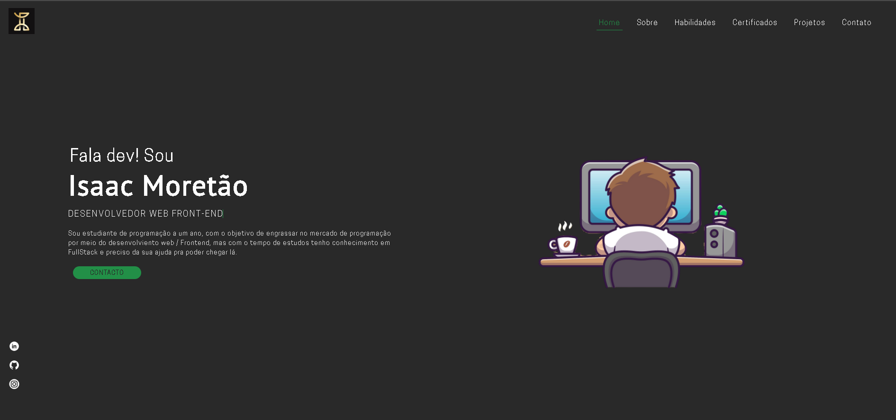

<h1 align="center">
  🙋‍♂️ Isaac Moretão 
</h1>

  I'm a Programming Student focused on ReactJs, I'm looking for my first job 
  as a programmer in the job market, you can see other projects of mine, on my GitHub profile,
  if you give me a star in this repository I would be very grateful, and if you can comment what you think you help me improve  

  

<h1 align="center">
  Project 
</h1>

  

<h1 align="center">
  📝 License
</h1>

  Esse projeto está sob a licença MIT. Veja o arquivo [LICENSE](LICENSE) para mais detalhes.

---